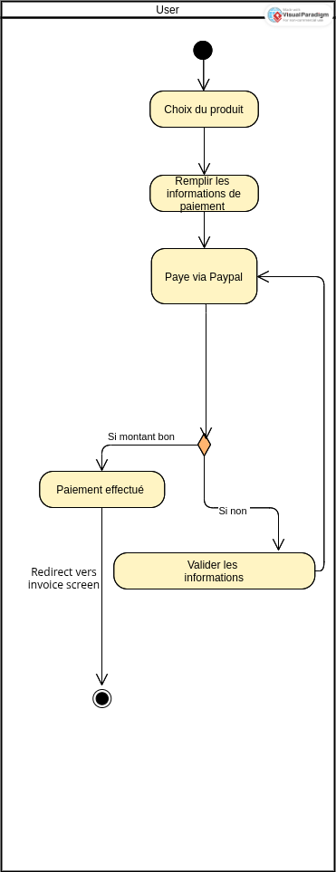
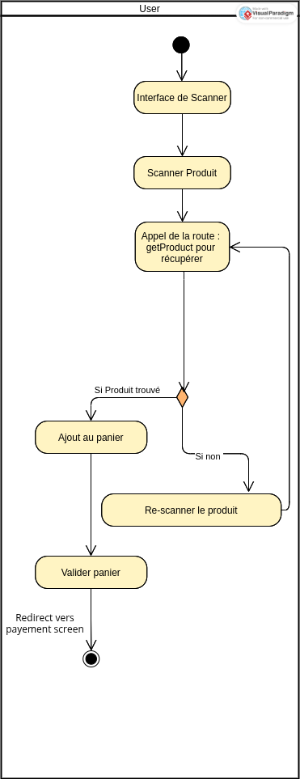

# Complex flows

The application features a few complex activities. We must document them bellow when we implement one.

## Paypal

For paypal, the tricky part is that we need to specify redirect urls that handle **success** and **cancel** states.

We choose to redirect the users to *invoices* on success, and to encourage them to try again by staying on the payment page on any error/cancel. We use a toast notification to make 

## Scanner

For the scanner, the difficulty comes once again from managing error cases, but our solution is slightly different: we always stay on the scanner page, and communicate errors and successes through messages and colours.

