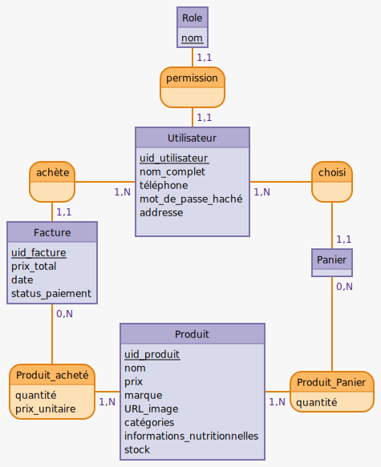

# Spécifications de l'architecture backend

## Modèles

Après analyse des besoins et conformément au sujet, nous établissons le modèle de données suivant:

```mcd
+Role: nom

permission, 11 Utilisateur, 11 Role

achète, 1N Utilisateur, 11 Facture
Utilisateur: uid_utilisateur, nom complet, téléphone, mot de passe haché, addresse, 
choisi, 1N Utilisateur, 11 Panier

Facture: uid_facture, prix total, date, status paiement
:
Panier: 

Produit acheté, 1N Produit, 0N Facture: quantité, prix unitaire
Produit: uid_produit, nom, prix, marque, URL image, catégories, informations nutritionnelles, stock
Produit Panier, 1N Produit, 0N Panier: quantité
```



On utilise Mongoose pour intéragir avec MongoDB, selon une logique de *schémas*.
On pourrait représenter nos schémas ainsi avec un diagramme de classe:


## Traitement des données

Les données décrites par ces modèles sont modifiables grâce à l'API RESTful, en CRUD selon les rôles, sauf les produits qui sont récupérés depuis l'API de OpenFoodFacts, suivant la logique suivante:


