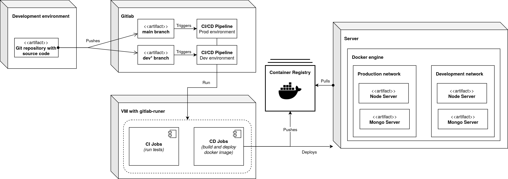

# Overview Architecture et DevOps


## Description technique du projet

Le projet Trinity est une initiative complète visant à améliorer l'expérience client et l'efficacité opérationnelle d'une chaîne de supermarchés. Il s'agit d'un projet tripartite comprenant des composants DevOps, Web et Mobile qui doivent être développés et déployés de manière cohérente et coordonnée.

L'objectif principal est de développer un écosystème logiciel permettant :
- L'amélioration de l'expérience utilisateur et la simplification du processus d'achat via une application mobile ;
- L'optimisation de la gestion des produits et la visualisation des indicateurs de performance via une application web ;
- La mise en place d'une infrastructure DevOps robuste pour assurer un développement et un déploiement continus.

### Architecture

La réalisation du projet Trinity nécessite quatres composants principaux, tous reliés par une infrastructure DevOps commune :

1.  **Application Web** - Interface de gestion pour les administrateurs permettant avec CRUD des produits, suivi des utilisateurs et de leurs achats, KPIs personnalisés ;
2. **Application Mobile** - Interface clients finaux, avec scan de produits, panier d'achats, paiement via PayPal, et historique des paiements ;
3. **API REST** - Constituant le coeur du système, elle gère l'authentification, la gestion les données (inventaire, facturation...), et la génération de KPIs ;
4. **Base de données** - Permettant de stocker les données envoyées à l'API.

Nous optons pour le choix audacieux de réaliser un unique client web, qu'il sera possible de build en deux versions (web et mobile) répondant au impératif du projet.

### Technologies

Conformément au sujet ou après délibérations, voici les technologies que nous choisissons pour chaque composant :

**Backend/API** :
- Node.js avec Express.js - Pour la création d'une API RESTful performante, avec un pattern Modèles-Controleurs ;
- JWT - Pour la sécurisation des communications et l'authentification ;
- Jest - Pour les tests unitaires.

**Clients** :
- React.js - Pour une interface utilisateur réactive et modulaire ;
- Axios - Pour les communications avec l'API ;
- Cordova - Pour générer l'application mobile ;
- Jest - Pour les tests unitaires.

**Base de données**:
- MongoDB - Pour le stockage des données selon le modèle choisi.

**DevOps** :
- Docker et Docker Compose - Pour la conteneurisation ;
- GitLab CI/CD - Pour l'automatisation du pipeline ;
- GitLab Runners - Pour l'exécution des jobs CI/CD.


## Environnements

La mise en place de plusieurs environnements distincts est essentielle pour garantir la qualité et la stabilité du projet tout au long de son cycle de développement.

### Développement

L'environnement de développement est conçu pour maximiser la productivité des développeurs tout en préservant l'intégrité du système.

**Caractéristiques** :
- Outils de débogage activés ;
- Variables d'environnement spécifiques au développement ;
- CORS configuré pour accepter toutes les origines en développement ;
- Pas d'optimisation du code ;
- Volume synchronisant le code du container avec la copie du projet sur la machine ;
- Hot module reloading ou apparenté.

### Staging

L'environnement de staging (pré-production) sert de miroir à l'environnement de production, permettant de tester les fonctionnalités dans des conditions proches de la production avant le déploiement final.

**Caractéristiques** :
- Configuration identique à la production ;
- Base de données avec un jeu de données représentatif.

### Production

L'environnement de production est optimisé pour les performances, la sécurité et la stabilité.

**Caractéristiques** :
- Tests automatisés complets ;
- Code optimisé et minifié ;
- CORS et cookies stricts et sécurisés ;
- Journalisation d'erreurs uniquement ;
- Variables d'environnement sécurisées ;
- Déploiement avec zéro temps d'arrêt ;


## Pipeline CI/CD

Le pipeline CI/CD est conçu pour automatiser le processus de développement, de test et de déploiement du projet, garantissant ainsi la qualité du code et la stabilité des déploiements.

**Étapes du pipeline** :




## Installation des GitLab runners

Les GitLab Runners sont des agents qui exécutent les jobs définis dans les pipelines CI/CD. Voici la procédure d'installation et de configuration sur une machine virtuelle dédiée :

### Prérequis
- Machine virtuelle Linux (Ubuntu Server LTS recommandée) ;
- Accès root ou sudo ;
- Docker installé ;
- Connexion réseau à l'instance GitLab.

### Étapes d'installation

1. **Installation de GitLab Runner**
   ```bash
   curl -L "https://packages.gitlab.com/install/repositories/runner/gitlab-runner/script.deb.sh" | sudo bash
   sudo apt-get install gitlab-runner
   ```

2. **Enregistrement du Runner**
   Suivre les instructions dans GitLab > Settings > CI/CD > Runners, puis exécuter la commande indiquée, type:

   ```bash
   sudo gitlab-runner register
   ```

   Choisir une image alpine par défaut.

3. **Configuration pour l'exécution des conteneurs Docker**
   ```bash
   sudo usermod -aG docker gitlab-runner
   sudo systemctl restart gitlab-runner
   ```

4. **Configuration avancée**
   Éditer le fichier `/etc/gitlab-runner/config.toml` pour modifier les paramètres avancés. Attention notamment à `privileged` qui intéragit avec les configurations DiD/DooD.

5. **Optimisation artefacts docker**
   Pour supprimer les images, containers, volumes, etc. périodiquement, ajouter un cron job (`sudo crontab -e`):
   ```cron
   */30 * * * * docker system prune -f
   ```

6. **Redémarrage et vérification**
   ```bash
   sudo systemctl restart gitlab-runner
   sudo gitlab-runner status
   ```

7. **Sécurisation des credentials**
   Utiliser les variables d'environnement CI/CD dans GitLab pour stocker les informations sensibles plutôt que de les inclure dans le code ou les configurations. Ces variables peuvent être masquées dans les logs et ne sont accessibles qu'aux jobs autorisés.
